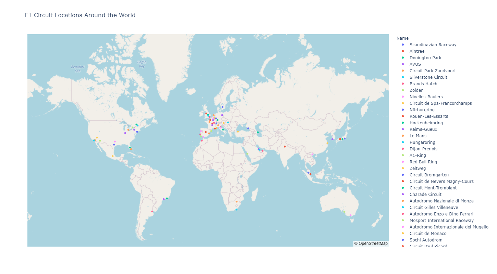
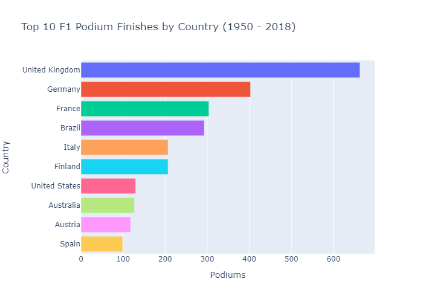
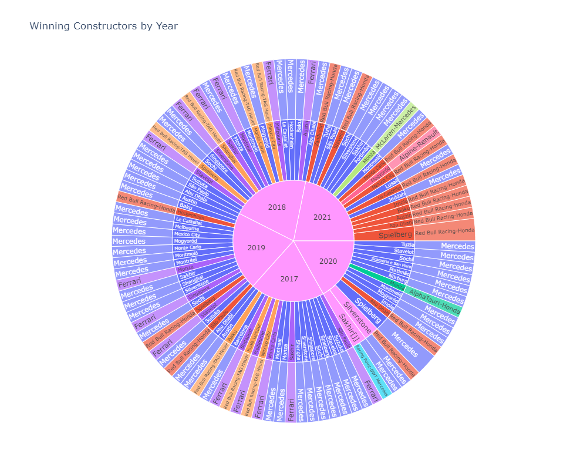
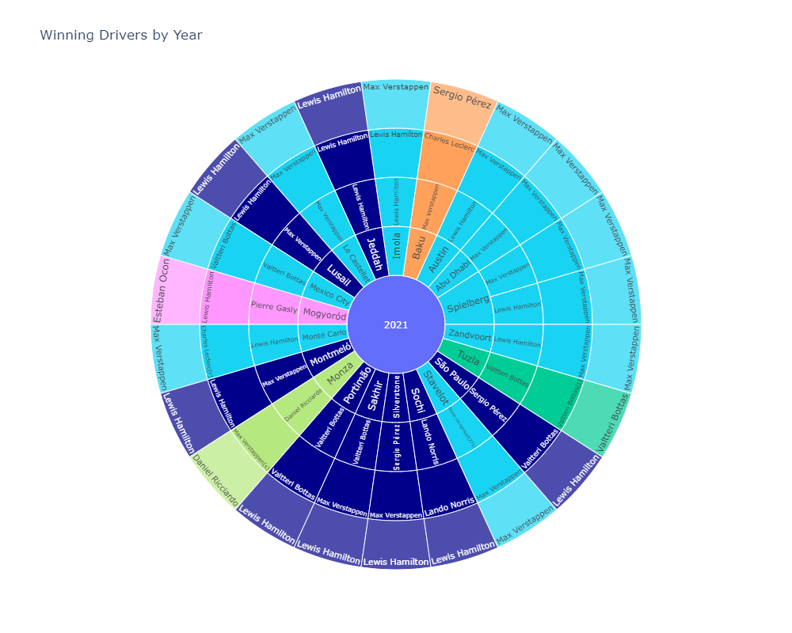

# Data Source and Python Package
* [Wikipedia](https://en.wikipedia.org/wiki/List_of_Formula_One_circuits)
* Python package used: [Fast F1](https://github.com/theOehrly/Fast-F1)
* Import from csv downloaded from website

# Images Used
* 

* In almost 70 year history of the race between 1950 and 2018, UK and Germany are the two countries that have chalked up the most nunber of wins - over 70% of the total races.

* UK's total number of wins nearly doubled that of Germany in during the period.

* Consistent with the earlier bar chart, UK and Germany drivers seem represent 45% (9 out of 20) of the top 20 drivers that have the most number of championship wins since the inception of F1 race in 1950 up until 2018.

* During the period under review, Mercedes and Ferrari appear to be the two dominant teams to be reckoned with consistently winning over 80% of the races between them from 2018 - 2020.

* Ferrari's performance appears to have declined after 2018 and did not record any champrionship wins at all in 2020 and 2021 whilst the Red Bull team looks like they have been given a new lease of life in 2021 at the expense of Mercedes.

* Among all the teams, Mercedes have the most consistent driving pair chalking up the most pole positions, fastest laps and wins.
* Other teams appear to have switched drivers between seasons which could possibly explain the less consistent results achieved due to new drivers adapting to the team.

# Challenges Faced
* Pushing and merging data to the main branch in the GitHub repository.
* The data clensing process was tedious.
* Flattening deeply nested JSON files.
* Some charts did not display until bokeh was reinstalled.

